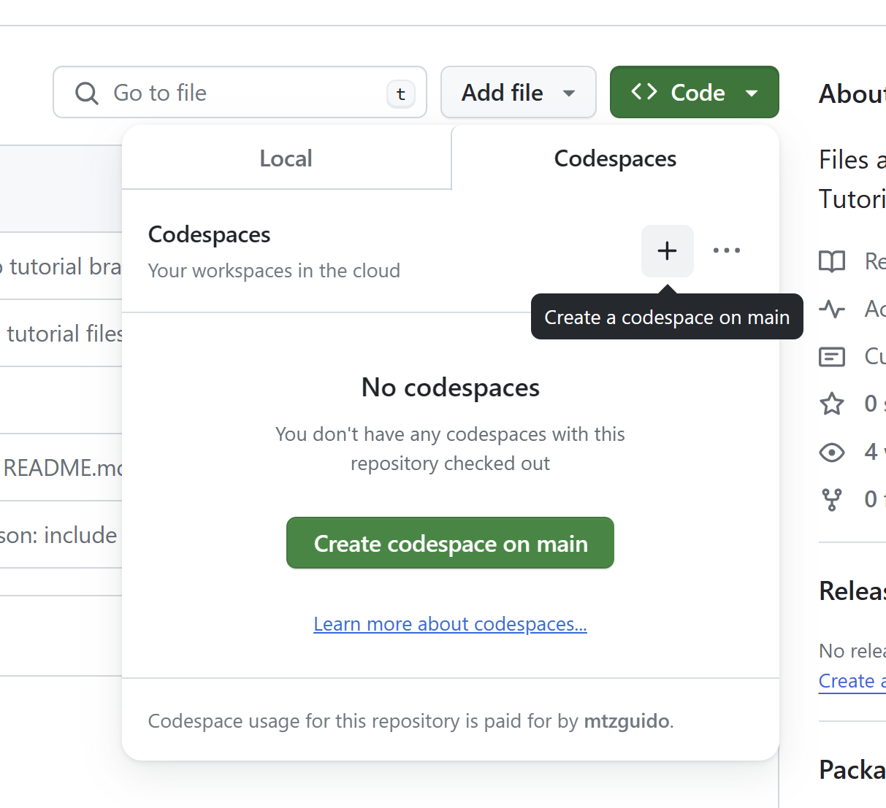
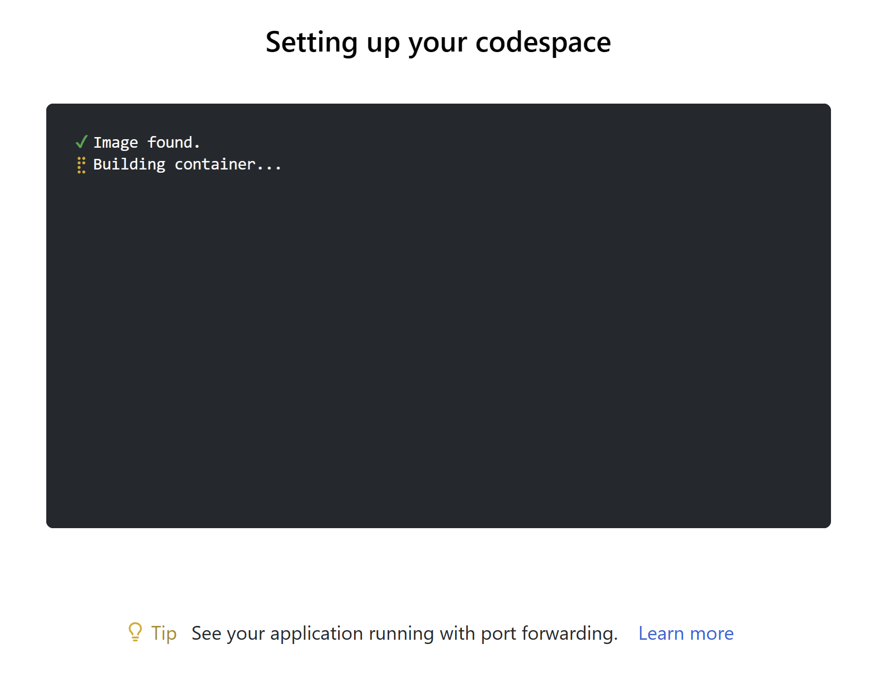

Pulse tutorial at POPL 24
=========================

Getting started (with Codespaces)
---------------------------------

To get a Pulse environment, you can create a codespace in this repo.
Click the '<>Code' button above and start a new codespace.

You should be greeted, after a minute or two, by a VS Code instance
running in your browser displaying this same README.

If you prefer a local UI instead of the browser, you can "open"
the Codespace from your local VS Code installation like so:

Everything is still running on Github's servers.

Running locally with VS Code
----------------------------

(Not recommended for the tutorial, it will take more time to set up.)

If you would like to run the tutorial locally, without relying on Github
Codespaces, you can clone this repository and open it in VS Code. VS
Code will suggest reopening the repository in the devcontainer. Or you
can manually run the command 'Dev Containers: Rebuild and Reopen in
Container'.

This will download a docker image to your machine and start a container.
It may be a lot slower than Github Codespaces depending on your internet
connnection.

You need the Docker extension installed for this. If you are using
Windows, it should be installed within WSL.

Basic commands
--------------

The VS Code instance will have the [F* VS Code extension installed](https://github.com/FStarLang/fstar-vscode-assistant). You can read the manual there,
but the most important things to know are the following:

* Fly-check on opening: When a file is opened, F* will, by default, 
  fly-check the entire entire contents of the file,
  stopping at the first error. Any errors will be reported in the problem pane
  and as "squigglies". Symbols are resolved and hover and jump-to-definition
  tools should work.

* F*: Check to position: The key-binding `Ctrl+.` advances the checker up to the
  F* definition that encloses the current cursor position, fully checking.

* F*: Light check to position: The key-binding `Ctrl+Shift+.` advances the checker by
  light-checking the document up to the F* definition enclosing the current cursor position.
  This is useful if you want to quickly advance the checker past a chunk of document which
  might otherwise take a long time to check.

* F*: Restart: The key-binding `Ctrl+; Ctrl+.` restarts the F* session for the current document,
  rewindind the checker to the top of the document and rescanning it to load any dependences
  that may have changed, and fly-checking it to load symbols.

* Check file on save: When the file is saved, or when doing `Ctrl+s`, the
  checker is advanced in full checking mode to the end of the document.
  This is equivalent to doing `Ctrl+.` on the last line of the document.

* 'F12' will jump to the definition of the symbol under the cursor.

Note, although checking the document proceeds in a linear, top-down fashion, at no point is any
fragment of the document locked. You can keep editing a document while F* is checking some prefix 
of it.

